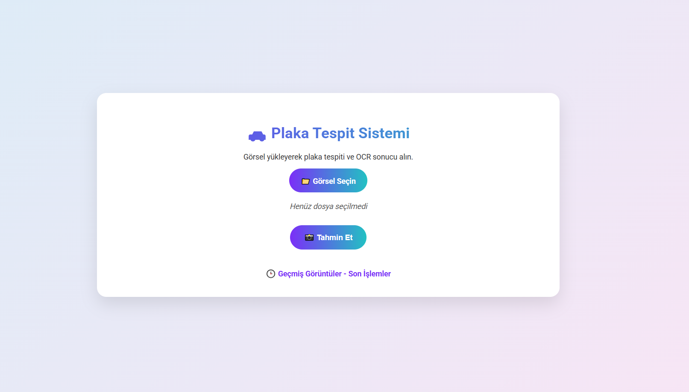
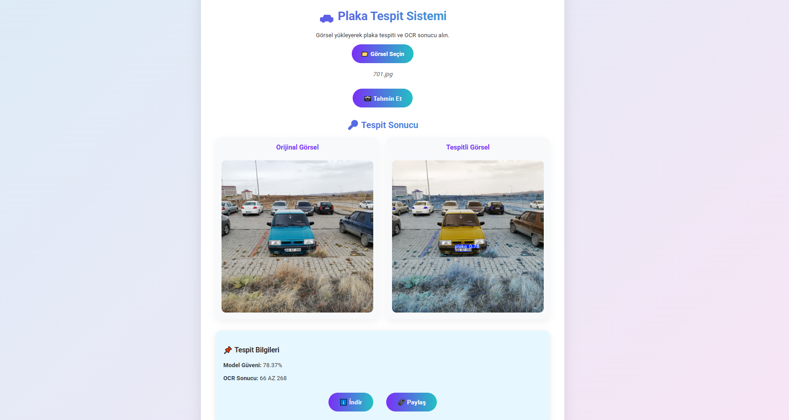
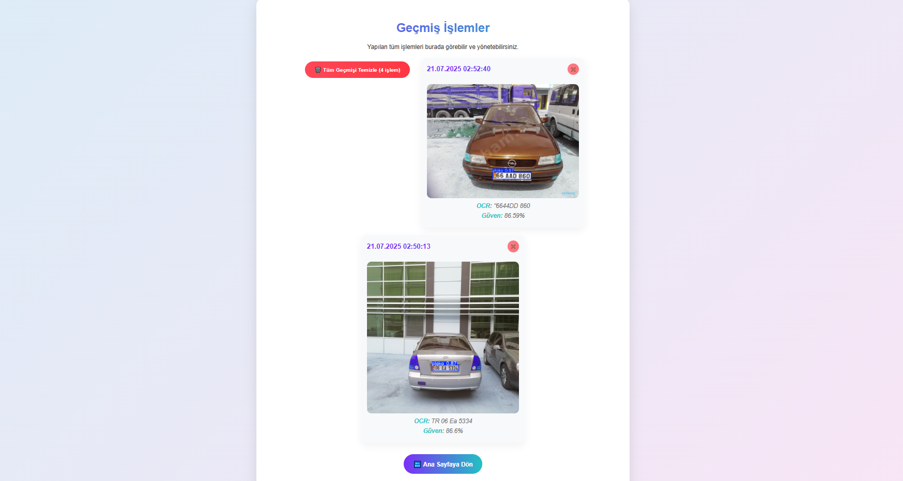
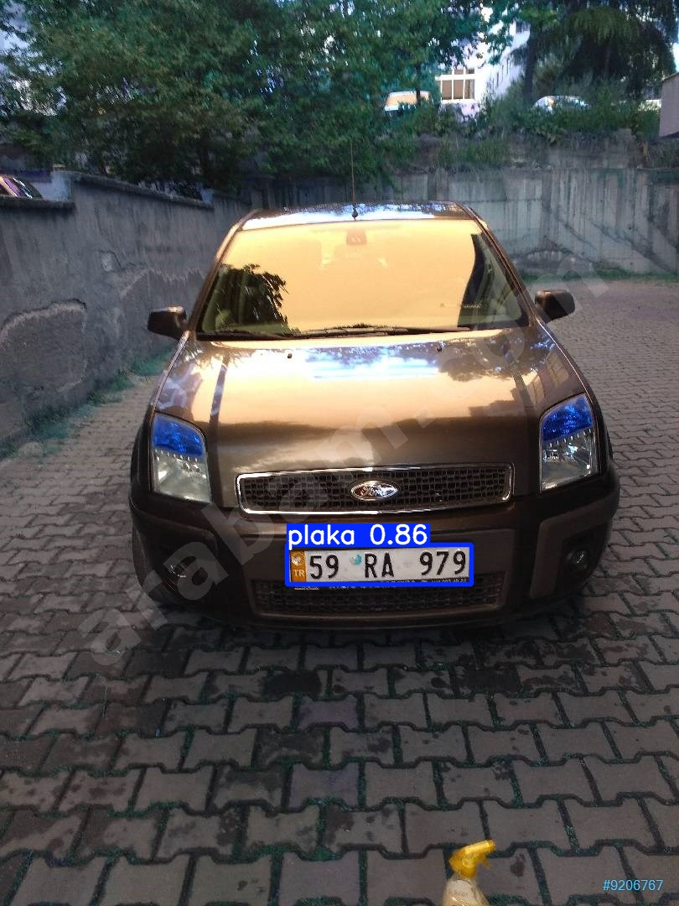

# Plaka Tespit Sistemi

Bu proje, YOLO modeli kullanarak plaka tespiti yapan ve OCR ile plaka metnini okuyan bir web uygulamasıdır.

## Özellikler

- Plaka tespiti (YOLO modeli ile)
- OCR ile plaka metni okuma
- Görsel yükleme ve işleme
- Güven skoru gösterimi
- İşlem geçmişi
- Responsive tasarım
- Sonuç indirme
- Paylaşım özelliği

## Kurulum

1. Gerekli paketleri yükleyin:
```bash
pip install -r requirements.txt
```

2. Model dosyasını `models/` klasörüne yerleştirin:
   - `models/best.pt` (YOLO model dosyası)

3. Uygulamayı çalıştırın:
```bash
python app.py
```

4. Tarayıcınızda `http://localhost:5000` adresine gidin.

## Kullanım

1. Ana sayfada "Görsel Seçin" butonuna tıklayın
2. Plaka içeren bir görsel yükleyin
3. "Tahmin Et" butonuna tıklayın
4. Sonuçları görüntüleyin
5. Geçmiş işlemleri "Geçmiş Görüntüler" linkinden takip edin
6. Geçmişteki işlemlerden tekil silme veya toplu silme işlemlerini gerçekleştirebilirsiniz

## Dosya Yapısı

```
hw6-plate-ui/
├── app.py                 # Flask uygulaması
├── requirements.txt       # Python bağımlılıkları
├── models/
│   └── best.pt           # YOLO model dosyası
├── static/
│   ├── styles.css        # CSS stilleri
│   ├── history.js        # Geçmiş sayfası JavaScript
│   └── uploads/          # Yüklenen görseller
├── templates/
│   ├── index.html        # Ana sayfa
│   └── history.html      # Geçmiş sayfası
└── utils/
    ├── image_processing.py # Görsel işleme fonksiyonları
    └── ocr.py            # OCR işlemleri
```

## Teknolojiler

- **Backend**: Flask, Python
- **AI/ML**: YOLO (Ultralytics), EasyOCR
- **Frontend**: HTML5, CSS3, JavaScript
- **Görsel İşleme**: OpenCV, PIL
- **Veri Saklama**: LocalStorage (geçmiş)


## Görseller





